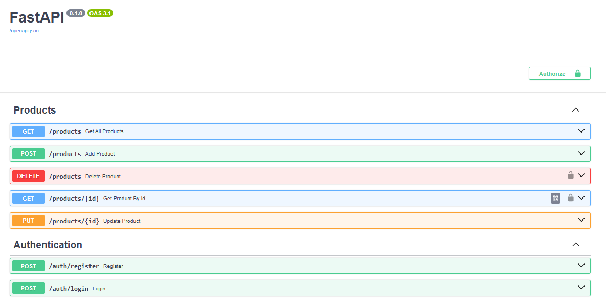

# Product Inventory API

A RESTful Product Inventory API built using **FastAPI**, **PostgreSQL**, and **SQLAlchemy**. This project demonstrates backend development concepts including CRUD operations, database integration, authentication, authorization, database migrations, and API testing.

## API Preview



## Features

* Product CRUD Operations

  * Create Product
  * View Products
  * Update Product
  * Delete Product

* User Authentication

  * User Registration
  * User Login
  * Password Hashing using Argon2
  * JWT Token Authentication

* Role-Based Authorization

  * User Role
  * Admin Role
  * Protected Endpoints

* Database Integration

  * PostgreSQL
  * SQLAlchemy ORM

* Database Migrations

  * Alembic

* API Testing

  * Pytest
  * FastAPI TestClient

## Tech Stack

### Backend

* Python
* FastAPI
* SQLAlchemy
* PostgreSQL
* Alembic

### Authentication & Security

* JWT Authentication
* pwdlib (Argon2)
* OAuth2PasswordBearer

### Testing

* Pytest
* HTTPX

## Project Structure

```text
product-inventory-api/
│
├── alembic/
├── models/
├── routers/
├── schemas/
├── tests/
│
├── config.py
├── database.py
├── security.py
├── main.py
├── requirements.txt
└── README.md
```

## API Endpoints

### Authentication

```http
POST /auth/register
POST /auth/login
```

### Products

```http
GET    /products
GET    /products/{id}
POST   /products
PUT    /products/{id}
DELETE /products/{id}
```

## Authentication Flow

```text
Register User
      ↓
Hash Password
      ↓
Store User
      ↓
Login
      ↓
Generate JWT Token
      ↓
Access Protected Endpoints
```

## Role-Based Access

### User

* View Products

### Admin

* Create Products
* Update Products
* Delete Products

## Running Locally

### Clone Repository

```bash
git clone <repository-url>
cd product-inventory-api
```

### Create Virtual Environment

```bash
python -m venv prdapp_env
```

### Activate Virtual Environment

```bash
.\prdapp_env\Scripts\activate
```

### Install Dependencies

```bash
pip install -r requirements.txt
```

### Run Database Migrations

```bash
alembic upgrade head
```

### Start Server

```bash
uvicorn main:app --reload
```

## Testing

Run tests using:

```bash
pytest
```

## Learning Outcomes

This project helped me learn:

* REST API Development
* FastAPI Framework
* PostgreSQL Integration
* SQLAlchemy ORM
* Alembic Migrations
* JWT Authentication
* Role-Based Authorization
* Dependency Injection
* Environment Variable Management
* API Testing with Pytest

<!-- ## Future Improvements

* Refresh Tokens
* Pagination
* Search & Filtering
* Docker Support
* CI/CD Pipeline
* Deployment to Cloud
* API Documentation Enhancements -->

---

Built as part of my backend development learning journey using FastAPI and PostgreSQL.

